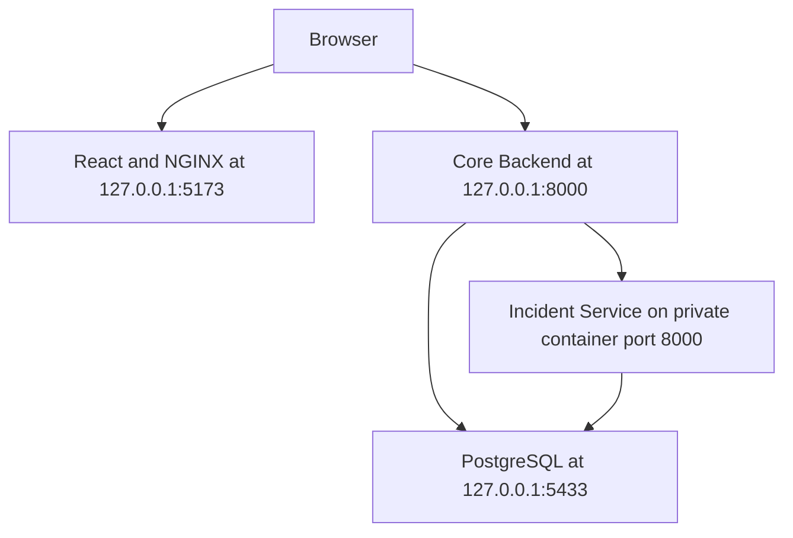

OpsFlow
OpsFlow is a full-stack operations-management platform built
around a React frontend, a FastAPI Core Backend, PostgreSQL,
and an independently deployable Incident Service.
The current architecture demonstrates:
Browser-facing API composition
Service Catalog and Incident Management boundaries
JWT authentication and authorization
Distributed request correlation
Structured JSON request logging
Safe-read retries
Circuit-breaker protection
Graceful partial-response degradation
Prometheus operational metrics
Hardened multi-stage container images
Automated cross-service quality verification
Architecture



The browser communicates with the public Core Backend.
The Incident Service is private to the Docker Backend network.
It is not published directly to the Windows host.
Application Boundaries
Frontend
The frontend is a React and TypeScript single-page
application built with Vite.
Frontend responsibilities include:
Authentication user interfaces
Responsive application navigation
Overview dashboard rendering
Service Catalog presentation
Incident Management presentation
Typed API-client boundaries
Loading, error, and degraded states
Client-side validation
Accessible interaction behavior
The production frontend is compiled in a Node.js builder
stage and served by an unprivileged NGINX runtime image.
Node.js, npm, source files, tests, and `node_modules` do not
enter the final runtime image.
Core Backend
The Core Backend is the browser-facing FastAPI application.
It owns:
Authentication
Authorization
User and session management
Password-reset coordination
Service Catalog persistence
Public API composition
Browser trust enforcement
CORS
Security headers
Request correlation
Structured request logging
Dependency resilience
Operational metrics
The public API prefix is:

```text
/api/v1
```

The Backend also exposes process-local Prometheus metrics at:

```text
/metrics
```

Incident Service
The Incident Service is an independently runnable FastAPI
application responsible for Incident Management.
It owns:
Incident API routes
Incident persistence
Incident validation
Incident-specific database migrations
Internal service authentication
Request correlation
Structured request logging
Operational HTTP metrics
The Incident Service does not implement browser-facing CORS,
CSRF, login, or password-reset behavior. Those concerns remain
at the public Core Backend boundary.
API Composition
The public Overview API is exposed by the Core Backend at:

```text
GET /api/v1/overview
```

The Overview response composes:
Local Service Catalog data
Remote Incident Management data
The browser makes one public Overview request. The Core
Backend coordinates the internal service call and returns one
typed response.
The browser never calls the private Incident Service directly.
Incident Gateway Boundary
The Core Backend depends on an application-level
`IncidentGateway` contract.
Two implementations are available:
`LocalIncidentGateway`
`HttpIncidentGateway`
Local mode executes Incident Management through the existing
in-process service boundary.
HTTP mode delegates Incident Management to the independently
running Incident Service.
Docker Compose uses:

```text
INCIDENT_GATEWAY_MODE=http
```

The local Backend environment defaults to:

```text
INCIDENT_GATEWAY_MODE=local
```

This preserves a controlled rollback path while the
distributed architecture is evaluated.
Resilience Model
Safe-read retries
Safe Incident Service reads can be retried.
The default distributed configuration uses:

```text
INCIDENT_SERVICE_READ_MAX_ATTEMPTS=2
INCIDENT_SERVICE_READ_BACKOFF_SECONDS=0.1
```

One failed safe-read operation can therefore produce:

```text
1 logical operation
2 physical transport attempts
1 retry
```

Retries are not automatically applied to create, update, or
delete operations because mutation idempotency keys have not
yet been introduced.
Circuit breaker
The Core Backend maintains a process-local, thread-safe
circuit breaker for Incident Service operations.
The default configuration is:

```text
INCIDENT_SERVICE_CIRCUIT_FAILURE_THRESHOLD=3
INCIDENT_SERVICE_CIRCUIT_RECOVERY_SECONDS=15.0
```

The circuit states are:

```text
closed
open
half_open
```

Three consecutive failed logical operations open the circuit.
While open, subsequent Incident Service operations fail
before making another network request.
After the recovery interval, one request is allowed to become
the half-open probe:
A successful probe closes the circuit.
A failed probe reopens the circuit.
Concurrent callers continue to fail fast while the probe is
in progress.
Retries within one logical operation do not count as separate
circuit failures.
Graceful Overview degradation
Service Catalog data is required for the Overview response.
Incident Management data is optional for that composed read.
When a known Incident Gateway failure occurs, the Backend
returns HTTP `200` with:

```json
{
  "incidentDataAvailable": false,
  "incidents": [],
  "summary": {
    "activeIncidents": null,
    "customerImpactingIncidents": null
  }
}
```

The distinction between `null` and zero is intentional:
`0` means Incident Service responded and reported no active
incidents.
`null` means Incident Service was unavailable and the count
is unknown.
Authentication, authorization, Service Catalog failures, and
unexpected application errors remain fail-closed.
Observability
Request correlation
Both Python applications accept or generate an
`X-Request-ID`.
The Core Backend forwards the current request ID to the
Incident Service so one distributed request can be traced
across service logs.
Untrusted or malformed request identifiers are replaced.
Structured logging
The Core Backend and Incident Service emit structured JSON
request logs.
The logging boundary records operational metadata while
excluding credentials, authorization headers, cookies, reset
tokens, and request bodies.
Prometheus metrics
The Core Backend exposes:

```text
http://localhost:8000/metrics
```

Important metric families include:

```text
opsflow_http_requests_total
opsflow_http_request_duration_seconds
opsflow_dependency_operations_total
opsflow_dependency_attempts_total
opsflow_dependency_retries_total
opsflow_dependency_operation_duration_seconds
opsflow_circuit_breaker_state
```

Dependency metrics distinguish:
Logical operations
Individual transport attempts
Scheduled retries
Circuit-open rejections
Metric labels use bounded route templates and outcomes.
Resource identifiers, query strings, credentials, exception
messages, and raw URLs are not used as labels.
The Incident Service also exposes `/metrics` inside the
private Docker network.
Technology Stack
Frontend
React
TypeScript
Vite
React Router
Bootstrap
Handwritten CSS
Vitest
React Testing Library
Oxlint
NGINX
Backend
Python 3.13
FastAPI
Pydantic v2
SQLAlchemy
Alembic
PostgreSQL
Psycopg
HTTPX
Pytest
Ruff
Prometheus client
Infrastructure
Docker
Docker Compose
Multi-stage container builds
GitHub Actions
AWS SES password-reset delivery
Repository Structure

```text
opsflow/
├── .github/
│   └── workflows/
│       └── opsflow-quality.yml
├── .githooks/
│   └── pre-commit
├── backend/
│   ├── app/
│   ├── migrations/
│   ├── tests/
│   ├── .env.example
│   ├── Dockerfile
│   ├── pyproject.toml
│   └── requirements-runtime.txt
├── docker/
│   └── postgres/
│       └── init/
├── frontend/
│   ├── nginx/
│   ├── src/
│   ├── Dockerfile
│   ├── package.json
│   └── package-lock.json
├── incident-service/
│   ├── app/
│   ├── migrations/
│   ├── tests/
│   ├── .env.example
│   ├── Dockerfile
│   ├── pyproject.toml
│   └── requirements-runtime.txt
├── scripts/
│   └── trim_trailing_whitespace.py
├── .env.docker.example
├── .gitignore
├── compose.yaml
└── README.md
```

Configuration Files
OpsFlow separates orchestration configuration from
application configuration.
Docker Compose configuration
Copy:

```text
.env.docker.example
```

to:

```text
.env.docker
```

The real `.env.docker` file must not be committed.
Every Compose command must explicitly use:

```bash
docker compose --env-file .env.docker <command>
```

Docker Compose does not automatically load a file named
`.env.docker`.
Backend configuration
Copy:

```text
backend/.env.example
```

to:

```text
backend/.env
```

The real `backend/.env` file must not be committed.
Incident Service configuration
For host-side Incident Service development, copy:

```text
incident-service/.env.example
```

to:

```text
incident-service/.env
```

The real `incident-service/.env` file must not be committed.
Docker Compose injects Incident Service runtime configuration
directly and does not share the Backend environment file.
Docker Compose Setup
The following commands are written for Windows with Git Bash.

1. Create local configuration files
   From the repository root:

```bash
cp .env.docker.example .env.docker
cp backend/.env.example backend/.env
cp incident-service/.env.example incident-service/.env
```

Replace every placeholder secret in the real local files.
Service private keys remain file-backed under the ignored
`.opsflow-secrets/` directory and are distributed through
read-only Compose secrets. Do not commit real environment
files or key material.

2. Validate Compose configuration

```bash
docker compose --env-file .env.docker config --quiet
```

Successful validation returns no output. 3. Build the images

```bash
docker compose --env-file .env.docker build
```

4. Start the stack

```bash
docker compose --env-file .env.docker up \
  --detach \
  --wait
```

5. Inspect service state

```bash
docker compose --env-file .env.docker ps
```

Expected persistent services:
`db`
`backend`
`incident-service`
`frontend`
Expected one-shot services:
`provision-databases`
`migrate`
`incident-migrate`
A one-shot service exiting with code zero is expected.
Local Addresses
Capability Address
Frontend `http://localhost:5173`
Backend API `http://localhost:8000/api/v1`
Backend OpenAPI `http://localhost:8000/docs`
Backend metrics `http://localhost:8000/metrics`
PostgreSQL host port `localhost:5433`
Incident Service Private Docker network only
Local Python Development
The repository root is not a Python package.
Do not run:

```bash
pip install -e ".[dev]"
```

Backend
From the repository root:

```bash
cd backend
py -3 -m venv .venv
./.venv/Scripts/python.exe -m pip install -r requirements-runtime.txt
./.venv/Scripts/python.exe -m pip install \
  "httpx==0.28.1" \
  "pytest==9.1.1" \
  "ruff==0.16.6"
```

Run quality checks:

```bash
./.venv/Scripts/python.exe -m ruff check app tests
./.venv/Scripts/python.exe -m pytest -q
```

Return to the root:

```bash
cd ..
```

Incident Service
From the repository root:

```bash
cd incident-service
py -3 -m venv .venv
./.venv/Scripts/python.exe -m pip install -r requirements-runtime.txt
./.venv/Scripts/python.exe -m pip install \
  "httpx==0.28.1" \
  "pytest==9.1.1" \
  "ruff==0.16.6"
```

Run quality checks:

```bash
./.venv/Scripts/python.exe -m ruff check app tests
./.venv/Scripts/python.exe -m pytest -q
```

Return to the root:

```bash
cd ..
```

Pytest and Ruff are intentionally absent from the hardened
runtime containers.
Frontend Development
From the repository root:

```bash
cd frontend
npm ci
npm run lint
npm run test:run
npm run build
cd ..
```

`npm run lint` invokes Oxlint. OpsFlow does not use ESLint.
Node.js and npm are intentionally absent from the production
frontend container.
Whitespace Enforcement
Activate the repository-managed Git hook:

```bash
git config core.hooksPath .githooks
```

Verify:

```bash
git config --get core.hooksPath
```

Expected:

```text
.githooks
```

Run a repository-wide whitespace check:

```bash
py -3 scripts/trim_trailing_whitespace.py --check
```

Fix only unstaged and untracked supported source files:

```bash
py -3 scripts/trim_trailing_whitespace.py --fix-unstaged
```

The pre-commit hook never stages files automatically.
Automated Quality Workflow
The GitHub Actions workflow is:

```text
.github/workflows/opsflow-quality.yml
```

It runs:
Trailing-whitespace validation
Backend Ruff and pytest
Incident Service Ruff and pytest
Frontend Oxlint, Vitest, and production build
Docker Compose build and smoke verification
The Compose smoke job executes only after the first four jobs
succeed.

The distributed-authentication CI gates, runtime key-isolation
checks, and local reproduction commands are documented in:

```text
docs/runbooks/distributed-authentication-ci.md
```
Controlled Incident Service Outage Drill
Stop only Incident Service:

```bash
docker compose --env-file .env.docker stop \
  incident-service
```

The expected Overview behavior is:

```json
{
  "incidentDataAvailable": false,
  "incidents": []
}
```

Restore Incident Service:

```bash
docker compose --env-file .env.docker up \
  --detach \
  --wait \
  incident-service
```

Wait longer than the default circuit recovery interval:

```bash
sleep 16
```

A successful Overview request then acts as the half-open probe
and returns the circuit to `closed`.
Do not stop PostgreSQL, Backend, or Frontend during the
Incident Service outage drill.
Security Boundaries
Real environment files are ignored by Git.
The Incident Service is not published to the Windows host.
Service-to-service requests require short-lived, scoped,
asymmetrically signed JWT credentials.
Each service retains its own private signing key and receives
only the other service's public verification key.
Service credentials and key paths must never use a `VITE_*`
variable.
Browser requests terminate at the Core Backend.
Runtime containers execute as non-root users.
Runtime application source is root-owned and read-only.
Linux capabilities are dropped.
`no-new-privileges` is enabled.
Runtime filesystems are read-only with bounded temporary
filesystems.
Backend and Incident Service runtime images exclude pip,
pytest, Ruff, and test source.
Frontend runtime excludes Node.js, npm, TypeScript, Vite,
source files, and tests.
Metrics exclude credentials and unbounded resource labels.
Structured logs exclude authorization headers, cookies,
tokens, and request bodies.
Project Status
The distributed Incident Management phase includes:
Independent Incident Service deployment
Internal service authentication
Public Backend API composition
HTTP Incident Gateway cutover
Local gateway fallback
Distributed request correlation
Structured request logging
Bounded safe-read retries
Circuit-breaker protection
Graceful Overview degradation
Prometheus operational metrics
Automated cross-service verification
Controlled outage and recovery validation

Portfolio architecture case study:

```text
docs/portfolio/distributed-authentication.md
```
