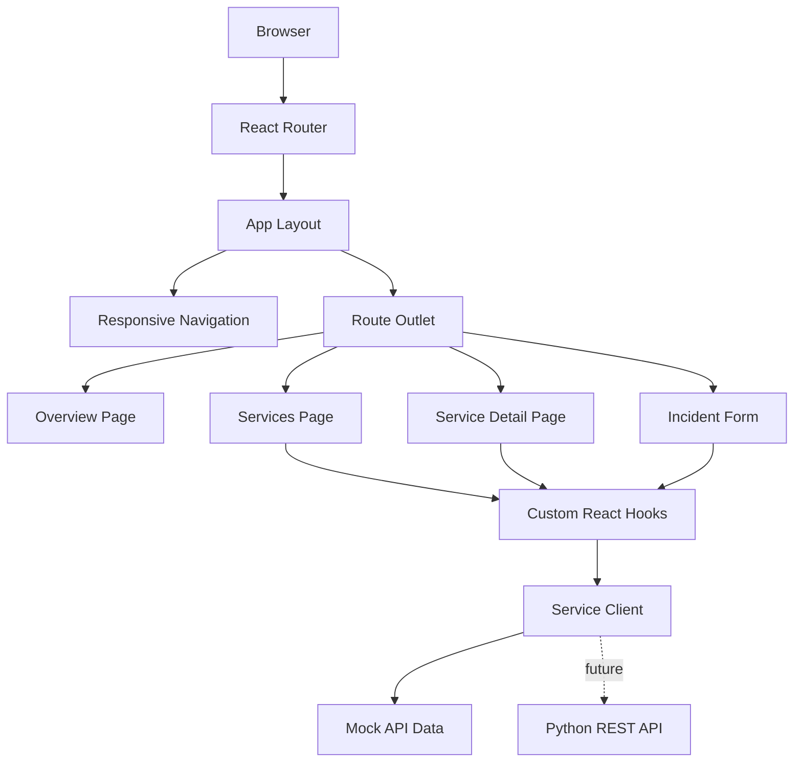

# OpsFlow

OpsFlow is a full-stack operations and fulfillment
management platform.

The project comprises of modern frontend development,
Python REST API architecture, containerization,
cloud infrastructure, automated testing, CI/CD,
networking concepts, and Infrastructure as Code.

## Technology Stack

### Frontend

- React
- TypeScript
- JavaScript
- Vite
- React Router
- Bootstrap
- Handwritten CSS
- Vitest
- React Testing Library

### Backend

- Python
- FastAPI
- RESTful APIs
- PostgreSQL

### Infrastructure

- Docker
- Kubernetes
- AWS
- Terraform
- GitHub Actions

## Frontend Architecture



## Frontend Engineering Decisions

### Bootstrap + Handwritten CSS

Bootstrap handles generic layout and UI primitives such
as the responsive grid, forms, buttons, cards, tables,
spacing, and typography.

Handwritten CSS handles OpsFlow-specific application
styling including branding, responsive navigation,
dashboard presentation, interaction states, and custom
responsive behavior.

### URL-Based Application State

React Router manages page navigation, dynamic service
routes, and query-string filters so views can be refreshed,
bookmarked, shared, and navigated using browser history.

### Typed Data Contracts

TypeScript interfaces, literal unions, generics,
discriminated unions, and type guards model application
data and state.

### Data Access Boundary

React components do not directly contain backend URL
or HTTP logic. Requests are routed through a service
client abstraction so mocked data can later be replaced
by the Python REST API without redesigning the UI.

## Frontend Structure

```text
frontend/src/
├── components/
│   ├── forms/
│   └── ui/
├── config/
├── data/
├── hooks/
├── layouts/
├── pages/
├── services/
├── styles/
├── test/
├── types/
└── validation/

```

```markdown
## Running the Frontend

### Requirements

- Node.js
- npm

### Install

cd frontend
npm install

## Current Frontend Features

- Responsive operations dashboard
- Desktop sidebar and mobile navigation drawer
- SPA routing
- Dynamic service detail routes
- URL-driven search and filtering
- Service health monitoring interface
- Operational activity timeline
- Incident reporting workflow
- Controlled forms
- Client-side validation
- Loading, empty, success, and error states
- Keyboard-friendly navigation
- Accessible form error relationships
- Reduced-motion support
- Unit and component tests
```

```

```
