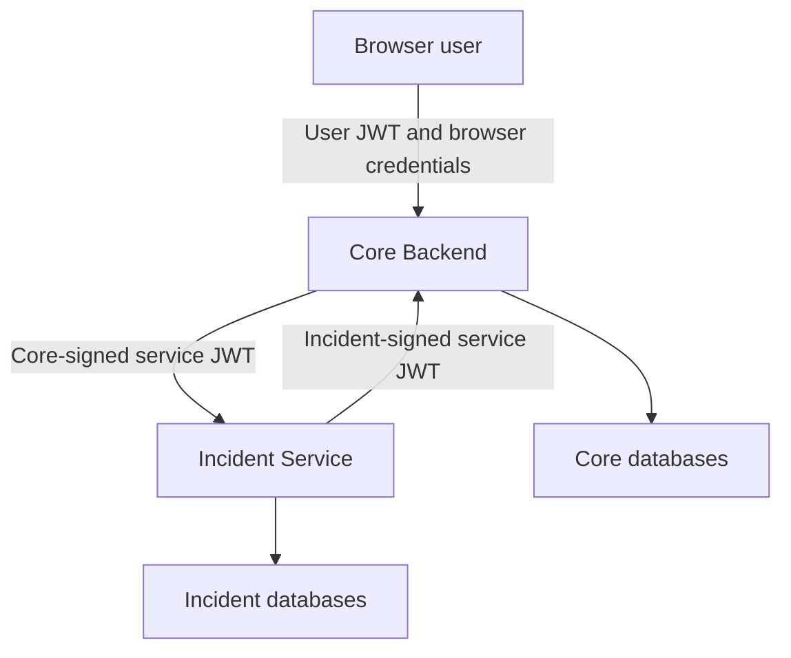

# OpsFlow Service Identity Contract

Status: Accepted
Date: 2026-09-16
Phase: 10 — Distributed Authentication and Testing

## Purpose

This document defines how independently running OpsFlow
services authenticate and authorize one another.

It covers:

- Core Backend to Incident Service authentication
- Incident Service to Core Backend authentication
- Service credential claims
- Signing and verification responsibilities
- Service-level permissions
- Authentication and authorization failures
- Key rotation
- Logging and metrics requirements
- Testing requirements

Browser authentication remains a separate trust boundary.

## Existing Browser Boundary

The Core Backend continues to own:

- User login
- User access JWT validation
- Refresh-token rotation
- Authentication-session revocation
- CSRF protection
- Reauthentication
- User roles
- User permissions

The Incident Service does not accept browser credentials.

The following values must never be forwarded to the Incident
Service:

- User access JWTs
- Refresh cookies
- CSRF tokens
- User passwords
- Password-reset tokens
- Reauthentication tokens

## Decision

OpsFlow services authenticate with short-lived,
asymmetrically signed service JWTs.

Each calling service signs its own credentials with its
private RSA key.

Each receiving service validates credentials with the
caller's public RSA key.

The services do not share private signing keys.

The former static shared credential and custom internal-token
header have been retired. Protected internal routes accept
only scoped bearer service JWTs.

## Trust Boundaries



The Docker private network limits reachability but does not
establish service identity.

A request is trusted only after its service JWT has passed
cryptographic and claims validation.

## Service Identities

The registered service identities are:

| Service          | Identity                   |
| ---------------- | -------------------------- |
| Core Backend     | `opsflow-core-backend`     |
| Incident Service | `opsflow-incident-service` |

A service JWT uses the calling service identity for both:

```text
iss
sub
```

The receiving service identity is used for:

```text
aud
```

## Directional Credentials

### Core Backend to Incident Service

The Core Backend signs the credential.

Required values:

```text
iss = opsflow-core-backend
sub = opsflow-core-backend
aud = opsflow-incident-service
token_use = service
```

Allowed permissions:

```text
incidents:read
incidents:write
```

The Incident Service receives only Core Backend public
verification keys.

It never receives the Core Backend private signing key.

### Incident Service to Core Backend

The Incident Service signs the credential.

Required values:

```text
iss = opsflow-incident-service
sub = opsflow-incident-service
aud = opsflow-core-backend
token_use = service
```

Allowed permission:

```text
services:read
```

The Core Backend receives only Incident Service public
verification keys.

It never receives the Incident Service private signing key.

## HTTP Credential Transport

Service credentials use the standard HTTP authorization
header:

```http
Authorization: Bearer <service-jwt>
```

Protected internal routes must not accept the retired custom
shared-secret header.

## JOSE Header Contract

Every service JWT must contain this protected-header shape:

```json
{
  "alg": "RS256",
  "typ": "JWT",
  "kid": "configured-key-identifier"
}
```

### `alg`

The only accepted algorithm is:

```text
RS256
```

Validation code must supply the accepted algorithm directly.

It must never select the verification algorithm solely from
the untrusted token header.

### `typ`

The type must be:

```text
JWT
```

### `kid`

The key identifier must select a configured public
verification key.

An unknown, missing, empty, or malformed key identifier
causes authentication failure.

The receiving service must not:

- Search the filesystem based on `kid`
- Construct a URL from `kid`
- Download an unknown key
- Treat `kid` as a filename
- Fall back to an arbitrary key

## Required Claims

Every service JWT must contain:

```text
iss
sub
aud
iat
nbf
exp
jti
token_use
scope
```

Example claim set:

```json
{
  "iss": "opsflow-core-backend",
  "sub": "opsflow-core-backend",
  "aud": "opsflow-incident-service",
  "iat": 1789552800,
  "nbf": 1789552800,
  "exp": 1789552860,
  "jti": "a typed UUID value",
  "token_use": "service",
  "scope": "incidents:read"
}
```

The timestamps above are illustrative only.

## Claim Validation

### Issuer

`iss` must exactly match the configured calling service
identity.

A value supplied by the token must not dynamically establish
a trusted issuer.

### Subject

`sub` must exactly match the configured calling service
identity.

For the current contract:

```text
sub == iss
```

### Audience

`aud` must exactly match the receiving service identity.

A Core-to-Incident token must not be accepted by Core.

An Incident-to-Core token must not be accepted by Incident.

### Issued At

`iat` is required.

It must be a numeric date accepted by the JWT library.

A token issued unreasonably far in the future must be
rejected.

### Not Before

`nbf` is required.

The receiving service must not accept the token before this
time, except for the configured clock-skew allowance.

### Expiration

`exp` is required.

Expired tokens must be rejected.

The token lifetime is calculated as:

```text
exp - iat
```

The lifetime must not exceed the configured maximum.

### Token Identifier

`jti` is required.

It must contain a valid UUID string.

The identifier supports:

- Request investigation
- Security-event correlation
- Future replay detection

The raw JWT must never be logged.

### Token Use

`token_use` must equal:

```text
service
```

This prevents browser access, refresh, and reauthentication
JWTs from being accepted as service credentials.

### Scope

`scope` is a space-delimited string of service permissions.

Examples:

```text
incidents:read
incidents:write
services:read
```

An empty or missing scope is invalid for a protected
operation.

Unknown scopes do not grant access.

## Service Permissions

### Incident Service permissions

| Operation                    | Required permission |
| ---------------------------- | ------------------- |
| List incidents               | `incidents:read`    |
| Get one incident             | `incidents:read`    |
| List incidents for a service | `incidents:read`    |
| Create an incident           | `incidents:write`   |
| Update an incident           | `incidents:write`   |
| Delete an incident           | `incidents:write`   |

### Core Backend internal permissions

| Operation                          | Required permission |
| ---------------------------------- | ------------------- |
| Determine whether a service exists | `services:read`     |

## User Authorization Relationship

Service authentication does not replace user authorization.

For a browser-originated incident operation, the required
order is:

```text
1. Core authenticates the user.
2. Core verifies the user's permission.
3. Core creates a service JWT for the required operation.
4. Incident validates the service JWT.
5. Incident verifies the required service scope.
6. Incident performs the operation.
```

Core must not create an outbound service credential before
the public request has passed its existing authentication and
authorization dependencies.

The service JWT does not contain the user's:

- ID
- Email
- Role
- Access JWT
- Session ID
- Refresh-token ID

End-user identity propagation is outside the Phase 10 scope.

## Token Lifetime

The default service-token lifetime is:

```text
60 seconds
```

The maximum configurable service-token lifetime is:

```text
120 seconds
```

The default permitted clock skew is:

```text
5 seconds
```

The maximum configurable clock skew is:

```text
30 seconds
```

Configuration validation must reject values outside the
documented bounds.

Short lifetimes limit the useful lifetime of a captured
credential.

## RSA Key Requirements

Service JWTs use RSA keys with a minimum size of:

```text
2048 bits
```

Private keys use PEM-encoded PKCS#8 format.

Public keys use PEM-encoded SubjectPublicKeyInfo format.

Private signing keys must never be:

- Committed to Git
- Included in container images
- Stored in browser configuration
- Added to a `VITE_*` variable
- Written to application logs
- Included in exceptions
- Sent to the verifying service

## Key Ownership

| Key                  | Owner            | Receives private key | Receives public key |
| -------------------- | ---------------- | -------------------- | ------------------- |
| Core signing key     | Core Backend     | Core Backend         | Incident Service    |
| Incident signing key | Incident Service | Incident Service     | Core Backend        |

The two key pairs must be different.

Using one key pair for both service identities is prohibited.

## Key Loading

Applications receive filesystem paths to their key material.

Private key contents must not be placed directly into
ordinary environment variables.

Key files must be mounted read-only.

Application configuration may contain:

- Private signing-key path
- Active signing-key identifier
- Current verification public-key path
- Current verification key identifier
- Previous verification public-key path
- Previous verification key identifier

The final runtime image must not contain development keys.

## Key Rotation

A receiving service may temporarily trust:

- The caller's current public key
- The caller's previous public key

Rotation follows this sequence:

```text
1. Generate the caller's replacement key pair.
2. Add the replacement public key to the receiver.
3. Deploy the receiver.
4. Switch the caller to the replacement private key and kid.
5. Deploy the caller.
6. Wait longer than the maximum token lifetime plus clock skew.
7. Remove the previous public key from the receiver.
```

The receiver selects verification keys only through the
configured `kid` mapping.

An unknown `kid` is rejected.

## Authentication Failure Contract

The following conditions return HTTP `401`:

- Missing Authorization header
- Unsupported authorization scheme
- Empty bearer credential
- Malformed JWT
- Unsupported algorithm
- Invalid signature
- Missing `kid`
- Unknown `kid`
- Missing required claim
- Invalid claim type
- Incorrect issuer
- Incorrect subject
- Incorrect audience
- Incorrect `token_use`
- Invalid `jti`
- Expired token
- Token not yet valid
- Token lifetime exceeding the allowed maximum

The response includes:

```http
WWW-Authenticate: Bearer
```

The public detail is:

```json
{
  "detail": "Invalid service credentials."
}
```

Missing and invalid credentials deliberately share the same
public response.

## Authorization Failure Contract

A cryptographically valid service JWT without the required
scope returns HTTP `403`.

The public detail is:

```json
{
  "detail": "Insufficient service permissions."
}
```

A `403` response proves that authentication succeeded but
authorization failed.

## Downstream Failure Translation

An internal service `401` or `403` must not be forwarded to a
browser as though the browser supplied invalid credentials.

Core translates an unexpected downstream authentication or
authorization failure into a non-sensitive gateway failure.

The browser must not receive:

- Internal issuer names
- Internal audience names
- Internal scopes
- Key identifiers
- Validation exception details
- Raw service tokens

## Logging

Authentication and authorization events use bounded reason
values.

Permitted authentication-failure reasons include:

```text
missing_credential
invalid_credential
expired_credential
unknown_key
invalid_claims
```

Permitted authorization-failure reason:

```text
insufficient_scope
```

Logs must never contain:

- Authorization header values
- Raw JWTs
- Private keys
- Public-key contents
- JWT signatures
- Unvalidated claim dictionaries
- Exception representations containing credentials

A validated service identity may be logged after successful
verification.

A token `jti` may be transformed through a keyed fingerprint
before logging. The raw `jti` should not be required for
ordinary request logs.

## Metrics

Authentication metrics must use bounded labels.

Permitted dimensions include:

- Receiving service
- Outcome
- Bounded failure reason

Metrics must not use:

- Raw tokens
- Raw `jti` values
- Request IDs
- Exception messages
- URLs containing identifiers
- Unvalidated issuer values
- Unvalidated subjects
- Key contents

## Testing Requirements

### Token creation tests

Tests must verify:

- Required headers
- Required claims
- Correct issuer
- Correct subject
- Correct audience
- Correct service-token use
- Correct scope
- Short expiration
- Unique `jti`
- Active `kid`

### Token validation tests

Tests must reject:

- Missing credential
- Invalid authorization scheme
- Empty bearer value
- Malformed JWT
- Invalid signature
- Unknown `kid`
- Wrong issuer
- Wrong subject
- Wrong audience
- Wrong `token_use`
- Expired token
- Premature token
- Missing claim
- Invalid `jti`
- Excessive token lifetime

### Scope tests

Tests must prove:

- Read scope permits reads
- Read scope does not permit mutations
- Write scope permits mutations
- Missing scope returns `403`
- Unrelated scope returns `403`
- `services:read` permits only the internal Service Catalog
  operation

### Boundary tests

Tests must prove:

- Browser JWTs are rejected by service dependencies
- Service JWTs are rejected by user dependencies
- Core never forwards a browser JWT
- Incident never receives refresh or CSRF credentials
- Internal credentials are absent from errors and logs

### Distributed tests

Compose tests must prove:

- Valid Core-to-Incident authentication
- Missing Core-to-Incident credential rejection
- Invalid Core-to-Incident credential rejection
- Valid Incident-to-Core authentication
- Missing Incident-to-Core credential rejection
- Invalid Incident-to-Core credential rejection
- Wrong-audience rejection
- Recovery after a controlled key rotation

## Security Observability

Both receiving services record authentication and
authorization outcomes without recording credentials or
unbounded identity data.

### Authentication failure classification

The public response remains deliberately generic:

```text
Invalid service credentials.
```

Internally, a rejected service credential is assigned one of
the following bounded reasons:

```text
malformed_credential
invalid_algorithm
invalid_token_type
missing_key_id
unknown_key
invalid_signature
invalid_issuer
invalid_audience
invalid_claim_contract
invalid_token_use
invalid_lifetime
invalid_scope_contract
```

The receiving dependency separately classifies an absent
Bearer credential as:

```text
missing_credential
```

These classifications must never contain a JWT, claim value,
key ID, exception message, header value, or request body.

### Prometheus metrics

Both services expose these bounded counters:

```text
opsflow_service_authentication_attempts_total
opsflow_service_authorization_decisions_total
```

Authentication labels are restricted to:

```text
outcome = success | failure
reason  = authenticated | <bounded failure reason>
```

Authorization labels are restricted to:

```text
outcome = granted | denied
scope   = incidents:read | incidents:write | services:read
```

Runtime allowlists reject arbitrary label values. Tokens,
request IDs, resource IDs, issuer values, subjects, key IDs,
and exception messages must not become metric labels.

### Structured service-security events

Both services emit JSON events using these fixed event names:

```text
service_authentication
service_authorization
```

Events may include:

- A generated event ID
- A UTC occurrence timestamp
- A validated request ID
- A bounded outcome
- A bounded authentication reason
- A registered service scope

Events must not include:

- Authorization headers
- Bearer credentials
- JWT claims or payloads
- Key IDs or key material
- Cookie or CSRF material
- Request bodies
- Arbitrary exception text

Failure of the logging sink must not change the request
result or create an authentication availability dependency.

## Replay Boundary

Service JWT verification is stateless. A valid credential may
be presented more than once before it expires.

Replay exposure is bounded through:

- A short token lifetime
- Exact issuer and audience validation
- Operation-specific scopes
- Protected private keys
- Bounded clock skew
- Key rotation support

Phase 10 does not implement a distributed `jti` replay cache.
Adding one would require shared state, atomic consumption, and
an explicit availability policy. Documentation and portfolio
claims must not describe the current implementation as
providing one-time-token or replay-prevention guarantees.

## Migration Rules

The final architecture must not support an indefinite
shared-secret fallback.

During implementation:

1. Add service JWT issuance and validation.
2. Add service JWT unit and component tests.
3. Update both outbound gateways.
4. Update both receiving dependencies.
5. Update Compose key mounts and configuration.
6. Add distributed positive and negative tests.
7. Remove the static shared credential.
8. Remove the custom shared-secret header.
9. Remove shared-secret tests.
10. Verify that no committed source still references the
    retired credential.

The migration is complete only after the static credential is
removed from:

- Application configuration
- Environment templates
- Compose
- CI
- Gateways
- Dependencies
- Tests
- Documentation

The bidirectional cutover is complete. Core-to-Incident and
Incident-to-Core calls both use independently signed RS256
Bearer credentials. The retired custom shared-secret header
is rejected in both directions.

## Operational Boundary

Local Docker Compose currently uses ordinary HTTP on a
private bridge network.

Application-level JWT signing does not encrypt traffic.

Production deployment must provide encrypted transport
through one of:

- TLS
- Mutual TLS
- A service mesh
- An equivalent trusted infrastructure layer

Transport encryption is outside the local Phase 10
implementation but remains a production requirement.

## Future Identity Provider

The local signing implementation must remain behind narrow
application interfaces.

A future deployment may replace local signing with:

- OAuth 2.0 client credentials
- Cloud workload identity
- SPIFFE/SPIRE
- A service-mesh identity provider

Replacing the credential issuer must not require rewriting
Incident Management or Service Catalog business logic.

## Non-Goals

Phase 10 does not introduce:

- A custom OAuth authorization server
- Keycloak
- AWS Cognito
- Distributed browser sessions
- User JWT forwarding
- End-user impersonation claims
- Kafka or message queues
- Service-mesh installation
- Production certificate management
- Database redesign
