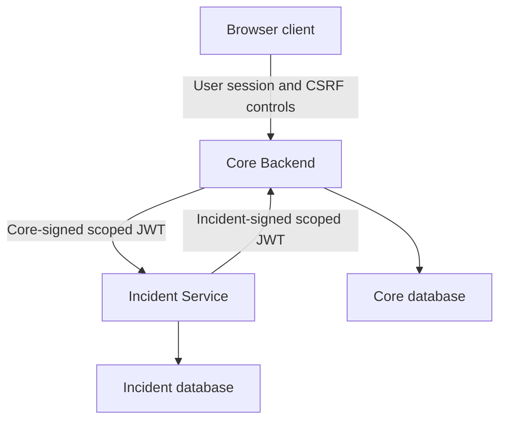
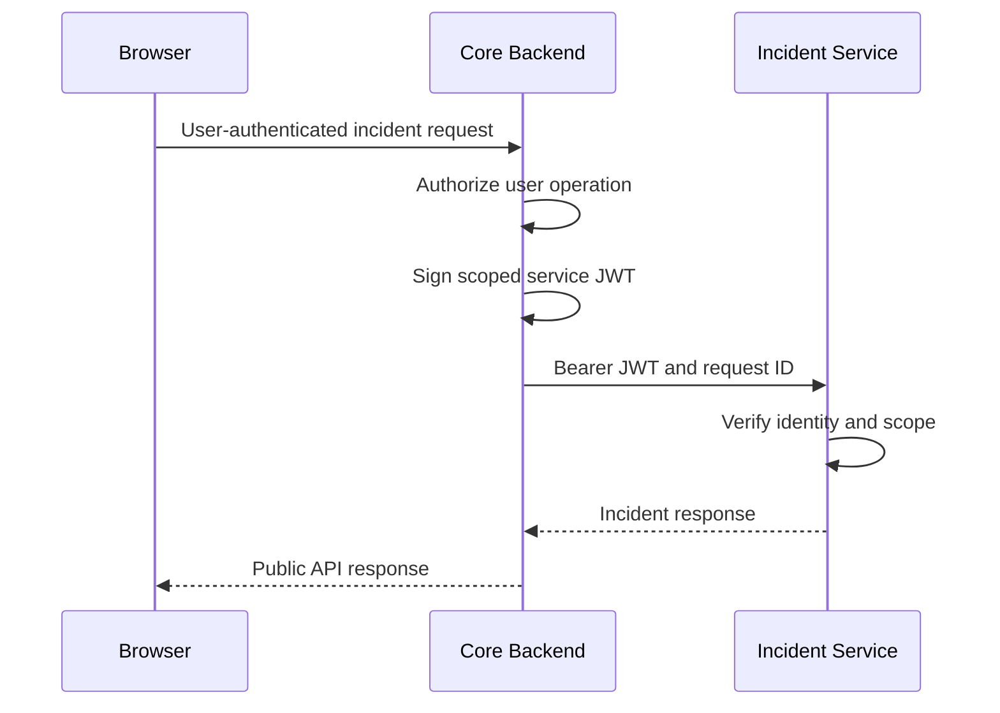

# OpsFlow Distributed Authentication

## Project case study

OpsFlow began as a modular application in which Core Backend
owned user authentication, service catalog data, and incident
management. Incident Management was later extracted into an
independently deployed FastAPI service with its own database,
migrations, health checks, metrics, and failure boundary.

The extraction created a new security problem: Core Backend
and Incident Service needed to authenticate each other without
forwarding browser credentials or relying on one permanent
shared secret.

The resulting design uses bidirectional asymmetric service
identity with short-lived, scoped JWT credentials.

## Architecture summary

Browser authentication terminates at Core Backend. Core never
forwards the user's access token, refresh token, cookies, or
CSRF material to Incident Service.

Each internal caller creates a separate credential for the
receiving service and requests only the scope required by the
operation.

## Service identities

| Identity | Issuer and subject | Intended audience | Signing-key owner |
|---|---|---|---|
| Core Backend | `opsflow-core-backend` | `opsflow-incident-service` | Core Backend |
| Incident Service | `opsflow-incident-service` | `opsflow-core-backend` | Incident Service |

The services use independent RSA keypairs. A private signing
key remains with its owning service. The receiving service
gets only the corresponding public verification key.

| Runtime | Private key | Public verification key |
|---|---|---|
| Core Backend | Core | Incident Service |
| Incident Service | Incident Service | Core |

This prevents either service from minting credentials as the
other identity merely because it can verify that identity.

## Credential contract

Service credentials use:

- RS256 signatures;
- a minimum 2048-bit RSA key;
- explicit `kid` selection;
- `typ=JWT`;
- `token_use=service`;
- issuer-bound subject;
- exact receiving-service audience;
- unique `jti`;
- `iat`, `nbf`, and `exp` timestamps;
- a 30–120 second lifetime;
- registered service scopes.

The current scopes are:

| Scope | Permission |
|---|---|
| `incidents:read` | List or retrieve incidents |
| `incidents:write` | Create, update, or delete incidents |
| `services:read` | Query the private Core service catalog |

Authentication and authorization are separate. A missing or
invalid credential returns a generic `401`. A trusted service
without the required scope returns `403`.

## Core-to-Incident request flow

Core selects `incidents:read` for safe reads and
`incidents:write` for mutations. Read retries remain bounded
and apply only to safe methods; mutations are not retried
automatically.

## Incident-to-Core request flow

Incident Service validates referenced service IDs through a
private Core endpoint. It creates an Incident-signed token with
`services:read`. Core verifies the Incident identity and scope
before querying its service repository.

The private endpoint does not accept a browser session as an
alternative authentication path.

## Fail-closed verification

The verifier rejects credentials with:

- malformed compact encoding;
- an unexpected algorithm or token type;
- a missing or unknown key ID;
- an invalid signature;
- an incorrect issuer, subject, or audience;
- a missing or incorrect token-use claim;
- an invalid timestamp or lifetime contract;
- an empty, duplicated, or unknown scope;
- a weak, invalid, or non-RSA verification key.

Public responses remain intentionally generic. Internal
metrics and structured events retain a bounded failure reason
for operations and incident response.

## Key distribution

Local Docker Compose uses file-backed, read-only secrets below
the ignored `.opsflow-secrets/` directory. Key contents do not
appear in Compose environment variables, container images,
Git, browser configuration, or application logs.

CI validates both the rendered Compose configuration and the
actual files visible inside each running container.

## Reliability boundary

Core accesses Incident Service through an HTTP gateway with:

- bounded timeouts;
- safe-read retries with backoff;
- no automatic mutation retries;
- circuit-breaker protection;
- graceful Overview degradation;
- request correlation;
- operational metrics.

Authentication failures are not treated as transient network
errors. They surface as configuration or trust failures rather
than being retried indefinitely.

## Security observability

Both services expose bounded Prometheus counters for service
authentication and authorization. They also emit structured
security events with bounded outcomes, failure reasons, and
registered scopes.

Credentials, claims, authorization headers, cookies, key
material, request bodies, and arbitrary exception strings are
excluded from these signals.

## Verification strategy

| Verification layer | Purpose |
|---|---|
| Unit tests | Token creation, claim enforcement, key loading, and scope parsing |
| Adversarial tests | Algorithm confusion, wrong key, malformed token, wrong claims, and insufficient scopes |
| Gateway tests | Correct audience, scope, header, and downstream error translation |
| Static contract | Prevent retired shared-token identifiers from returning |
| Compose contract | Verify exact key mounts and secret-file paths |
| Runtime isolation | Prove containers cannot access unauthorized private keys |
| Distributed smoke tests | Prove authenticated requests succeed in both directions |
| Full CI suites | Backend, Incident Service, frontend, migrations, images, and health checks |

GitHub Actions runs focused distributed-authentication tests
before the complete service suites. The Compose job runs only
after whitespace, Backend, Incident Service, and frontend jobs
succeed.

## Key engineering decisions

### Asymmetric keys instead of a shared secret

Public verification keys do not grant signing authority. This
creates a clearer trust boundary than distributing one shared
credential to both services.

### Separate user and service credentials

User authentication answers which person is acting. Service
authentication answers which workload is calling. Keeping
those credentials separate prevents a browser token from
becoming a general internal-service credential.

### Short-lived credentials instead of a static token

The service JWT lifetime is measured in seconds. This limits
the useful lifetime of a captured credential and removes the
former permanent shared-token fallback.

### Explicit scopes instead of identity-only trust

An authenticated service does not receive unrestricted access.
Each route requires a registered operation-specific scope.

### Bounded observability

Metrics and events use predefined labels and reasons. This
provides actionable security telemetry without leaking tokens
or allowing attacker-controlled cardinality.

## Current limitations

The implementation intentionally does not claim:

- distributed replay prevention;
- immediate revocation of an issued token;
- TLS on the local Compose bridge;
- cloud-managed workload identity;
- hardware-backed key storage;
- zero-downtime Incident signing-key overlap rotation.

Core signing-key rotation supports a bounded current/previous
public-key overlap at Incident Service. Incident signing-key
rotation currently requires a coordinated deployment with
Core's verification configuration.

Production deployment should add managed secret delivery,
encrypted service transport, formal rotation automation,
centralized alerting, and a documented compromise-response
procedure.

## Result

The migration replaced a static shared-token trust model with
independent service identities, asymmetric signatures,
least-privilege authorization, explicit key ownership,
security observability, and automated distributed validation.

The result demonstrates service decomposition without treating
network location as identity and without extending browser
credentials across service boundaries.

## Related documentation

- [Interview and résumé guide](distributed-authentication-interview-guide.md)
- [Service identity contract](../architecture/service-identity-contract.md)
- [Distributed authentication security review](../architecture/distributed-authentication-security-review.md)
- [Service identity key runbook](../runbooks/service-identity-keys.md)
- [Distributed authentication CI gates](../runbooks/distributed-authentication-ci.md)
